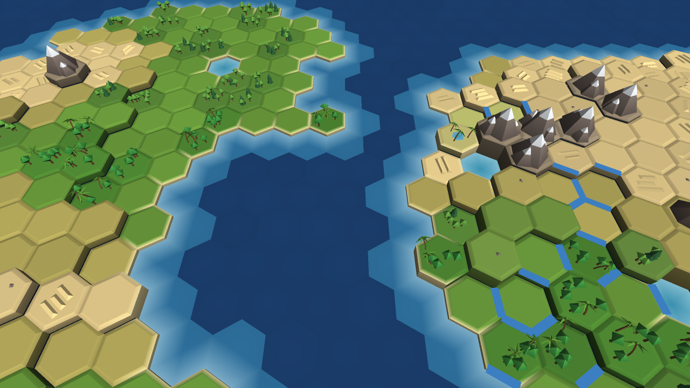
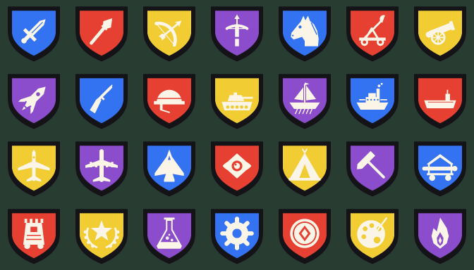
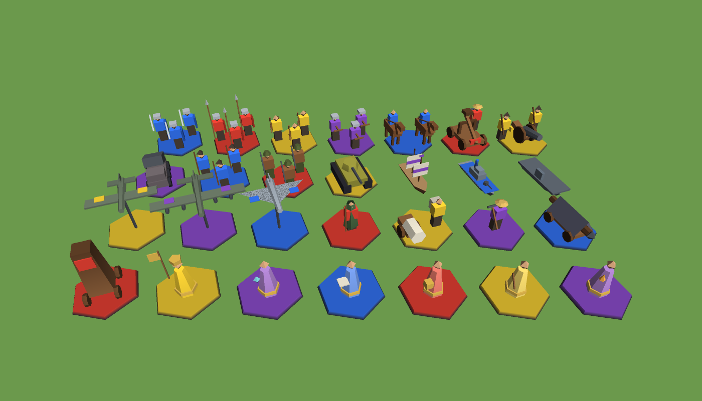
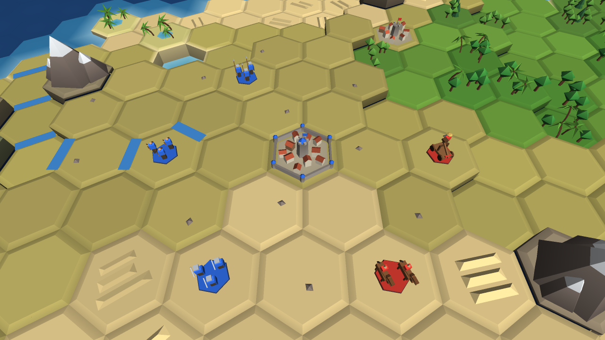

# Crucible of Ages

A Civilization V–style 4X with Humankind-style tactical combat, built in Unity (working title).
The full design is in **[docs/GDD.md](docs/GDD.md)**.

## Layout

| Path | What |
|---|---|
| `docs/GDD.md` | Game design document: systems, combat formulas, AI, architecture, milestones |
| `UnityProject/Assets/Scripts/Core` | Engine-agnostic, deterministic simulation (`Crucible.Core`): hex math, map gen, units, armies, battles, sieges, AI, victory |
| `UnityProject/Assets/Scripts/View` | Unity presentation (`Crucible.View`): low-poly world and miniatures (`Art/`), unit symbols (`Icons/`), camera, input, HUD |
| `UnityProject/Assets/Shaders` | Vertex-colour lit shader for the low-poly map |
| `tests/Crucible.Core.Tests` | xUnit tests that compile the Core sources directly, so no Unity is needed |

## Run the tests

```bash
cd tests/Crucible.Core.Tests
dotnet test
```

These cover the hex math, map generation (scripts, lakes, ice, natural wonders), cliffs, LOS,
the combat formula and modifiers, battle flow (rounds, turns, reserves, ZOC, retreat, sieges),
tactical AI determinism, army caps, the victory conditions, and the engine-free art (unit
symbols, miniatures and terrain meshes).

## Open in Unity

1. Unity **2022.3 LTS or newer**, **Built-in Render Pipeline** (the default 3D template).
2. In Unity Hub, choose **Add → Add project from disk** and pick `UnityProject/`. Unity generates
   `ProjectSettings/`, `Packages/` and the `.meta` files on first open. Commit them afterwards.
3. Create an empty scene, add an empty GameObject, attach **`GameBootstrap`**, and press **Play**.
   Its inspector picks the seed, map size and **map script** (Continents, Pangaea, Archipelago).
4. If you get Input errors, set *Project Settings → Player → Active Input Handling* to **Both**
   (the scaffold uses the legacy `Input` API).
5. For player builds, add `Crucible/VertexColorLit` to *Graphics → Always Included Shaders*.

### Look



Everything is procedural, so there are no art assets to import. The images here come from the
real geometry code, drawn by a small software renderer outside Unity, so the in-editor
lighting will differ a little.

- **World:** bevelled low-poly hexes with colour variation, sandy beaches and shore foam, rivers,
  pack ice at the poles, and decorations: conifer and broadleaf woods, jungle, marsh reeds,
  oasis palms, desert dunes, snow-capped mountain ranges, and three natural wonders (Emberfall
  Geyser, the Glass Dunes, the Worldspine).
- **Units:** Humankind-style miniatures. Foot troops are squads of three, cavalry are pairs of
  riders, and siege engines, tanks, ships and aircraft are single models, all in the owner's
  colour. Cities grow houses with population and raise walls and towers when fortified.
- **Unit flags:** Civ-style shields with a symbol for each unit type (sword, spear, bow,
  crossbow, horse, catapult, cannon, rocket, musket, helmet, tank, sail and steam ships,
  carrier, fighter, bomber, jet, scout, settler, worker, ram, siege tower and the six great
  people). They float over armies with a unit count, and also appear over units in battle, in the
  selection card and in the build list.

| Unit flags | Miniatures |
|---|---|
|  |  |



### Interface

The HUD is built with UI Toolkit entirely in code (no assets to set up):

- **Top bar:** gold, science, culture, faith, happiness, tourism, free strategic resources, a research button with a progress bar, and Policies / Diplomacy buttons that light up when something needs you. Save and Load are here too.
- **Notifications** slide in on the left: green for good news, red for bad, orange for war.
- **Right panel:** city screen (yields, growth, borders, build list with turns and **Buy**), research picker (what each tech unlocks), policy trees, diplomacy (treaties, opinion bars, proposals), city-states and siege camp.
- **Selection card** (bottom-left): the army's units with health bars and context buttons (Found city, Build farm, Automate, Besiege, Use great person…).
- **End turn** (bottom-right) warns about idle cities and armies that can still move.
- **Battles:** a banner with round/turn pips, walls and air support, an action bar, and a **combat preview** card listing every modifier and the expected damage (with KILL markers).
- **On the map:** city banners (population, growth and production bars), army flags with unit counts, flags and health bars over units in battle, and a tooltip for the hex under the cursor (including natural wonders and their yields).

### Controls

| Mode | Input |
|---|---|
| World | Click your army (blue), hover a hex to see the route and turns, and click to march there (multi-turn orders continue automatically). Click an adjacent enemy or city to attack. **Enter** ends the turn. |
| Cities | Click your city for its panel (growth, borders, production); pick what to build from the list, or **Buy** it with gold. **F** founds a city with a selected settler. **T** cycles research. **P** opens social policies. |
| Diplomacy | **L** opens the leaders screen: war and peace, open borders, defensive pacts, AI opinion, and proposals waiting for your answer. At peace you can't enter another civ's land without open borders. |
| Great people & city-states | With a great person selected, **V** uses their gift (Great Generals lead armies instead: merge them in). Click a city-state to see influence and gift gold. |
| Workers | With a worker selected: **I** builds the best improvement on its hex (moving cancels), **U** toggles automation. |
| Deployment | Click a unit, then a blue hex of your zone (swaps with friends). **Space** confirms. |
| Battle | Click a unit, then a green hex to move or a red enemy to attack. Hover an enemy to see the combat breakdown. **Space** ends the battle turn, **R** retreats, **X** auto-resolves the round, **B** batters the walls with the selected unit. |
| Reinforce | With an army next to an ongoing battle selected, click a battlefield hex to join it. |
| Siege | Next to an enemy city, **G** declares a siege (militia rise, the city stops growing). The siege panel spends siege progress on rams, siege towers and catapults. Click the city to assault it. |
| Camera | WASD/arrows pan, Q/E rotate, mouse wheel zooms (scrolls panels when over the HUD) · **Esc** closes a panel or deselects |
| Saving | **F5** quick-saves, **F9** quick-loads (`quicksave.crucible` in Unity's persistent data folder) |

## Status

Milestone **M0 (scaffold)** is done. **M1–M8** are mostly done: pathfinding, move orders, fog of war, deployment, reinforcements, auto-resolve, and the city economy (growth, production, buildings, gold, happiness, borders, research, settlers) sieges (walls, engines, militia, sorties), resources, workers and social policies, fleets, embarking, coastal battles, air power and buying with gold across all eight eras, and great people, religion, city-states, the World Congress, tourism and the spaceship. All five victory conditions can now be won. Games can be saved and loaded, and major civs make war and peace through diplomacy. See GDD §8 for the milestone plan. The AI opponent now
expands, builds armies, besieges and assaults your cities (`StrategicAI`). The tests include
AI-vs-AI skirmishes that end in domination.
