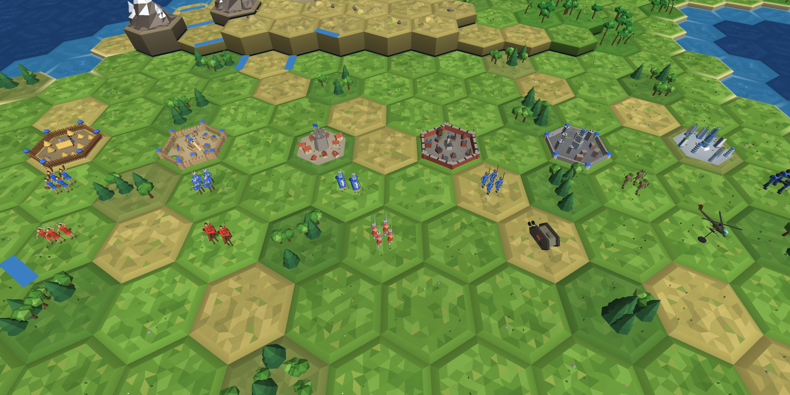
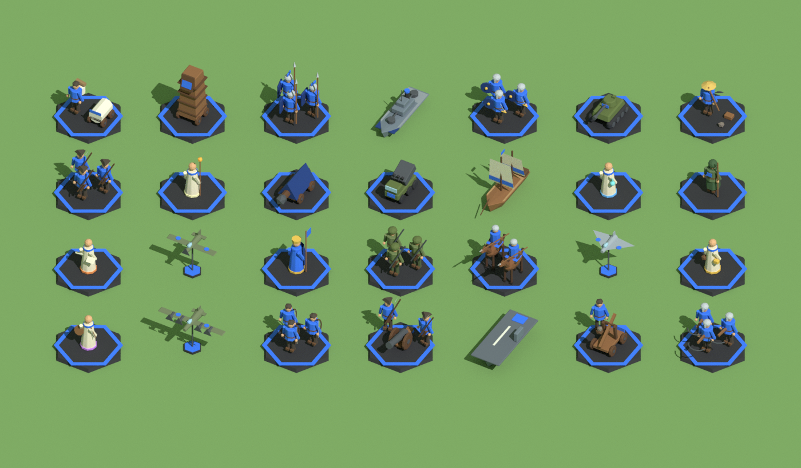
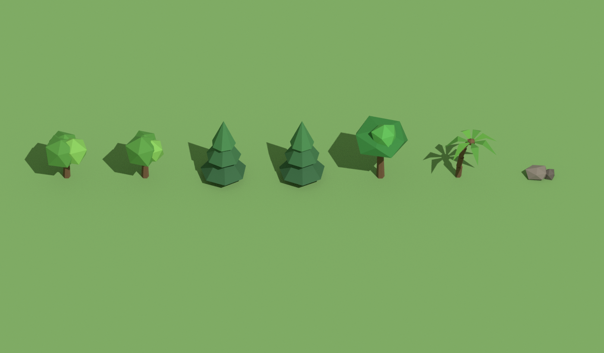
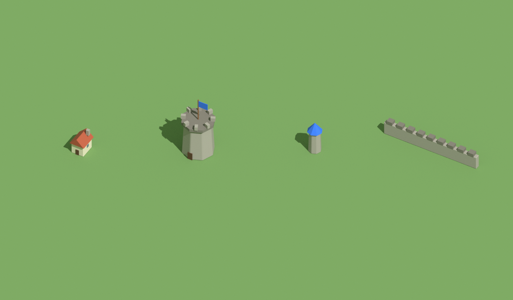
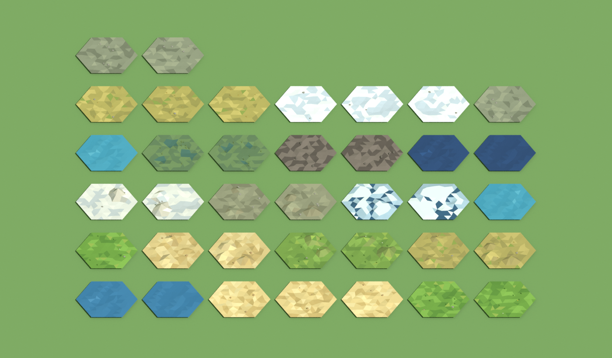

# Crucible of Ages

A Civilization V–style 4X with Humankind-style tactical combat, built in Unity (working title).
The full design is in **[docs/GDD.md](docs/GDD.md)**.

## Layout

| Path | What |
|---|---|
| `docs/GDD.md` | Game design document: systems, combat formulas, AI, architecture, milestones |
| `UnityProject/Assets/Scripts/Core` | Engine-agnostic, deterministic simulation (`Crucible.Core`): hex math, map gen, units, armies, battles, sieges, AI, victory |
| `UnityProject/Assets/Scripts/View` | Unity presentation (`Crucible.View`): low-poly world and miniatures (`Art/`), unit symbols (`Icons/`), camera, input, HUD |
| `UnityProject/Assets/Shaders` | Vertex-colour lit shader for the low-poly map |
| `tests/Crucible.Core.Tests` | xUnit tests that compile the Core sources directly, so no Unity is needed |

## Run the tests

```bash
cd tests/Crucible.Core.Tests
dotnet test
```

These cover the hex math, map generation (scripts, lakes, ice, natural wonders), cliffs, LOS,
the combat formula and modifiers, battle flow (rounds, turns, reserves, ZOC, retreat, sieges),
tactical AI determinism, army caps, the victory conditions, and the engine-free art (unit
symbols, miniatures and terrain meshes).

## Open in Unity

1. Unity **2022.3 LTS or newer**, **Built-in Render Pipeline** (the default 3D template).
2. In Unity Hub, choose **Add → Add project from disk** and pick `UnityProject/`. Unity generates
   `ProjectSettings/`, `Packages/` and the `.meta` files on first open. Commit them afterwards.
3. Press **Play**. A game starts in whatever scene is open (the new project's empty scene is fine).
   To pick the seed, map size and **map script** (Continents, Pangaea, Archipelago), add an empty
   GameObject with **`GameBootstrap`** to the scene and set them in its inspector.
4. If you get Input errors, set *Project Settings → Player → Active Input Handling* to **Both**
   (the scaffold uses the legacy `Input` API).
5. For player builds, add `Crucible/VertexColorLit` to *Graphics → Always Included Shaders*.

### Look


The terrain tiles, peaks, units, trees and cities are Blender models (see *Blender assets*). The rim, beaches, cliffs, rivers and wonders are procedural. The images here come from the real geometry, drawn by a small software renderer outside Unity, so the in-editor lighting will differ a little.

- **World:** bevelled low-poly hexes with colour variation, sandy beaches and shore foam, rivers,
  pack ice at the poles, and decorations: conifer and broadleaf woods, jungle, marsh reeds,
  oasis palms, desert dunes, snow-capped mountain ranges, and three natural wonders (Emberfall
  Geyser, the Glass Dunes, the Worldspine).
- **Units:** Civ V-style formations that stand straight on the terrain with no base. Foot troops are squads of three or four soldiers in period kit, with the owner's colour on tunics, shields and sails:
  - legionaries with scuta, hoplites with round shields and spears, archers drawing bows, crossbowmen, musketmen in tricorns and cross belts, and riflemen with helmets and packs;
  - lancers on horseback, and a mounted Great General with a standard;
  - catapult and cannon crews, a battering ram, a siege tower, a rocket truck and a tank;
  - a three-masted frigate, a destroyer, a carrier, and propeller and jet aircraft.

  Each age has its own troops on top of that: Neolithic clubmen and slingers, galleys with banks of
  oars, men-at-arms and knights in caparisons, gatling guns, First World War field guns and
  landships, machine-gun nests, helicopter gunships, modern armour, missile cruisers, nuclear
  submarines, a stealth bomber, exosuit infantry and a Giant Death Robot. Nuclear weapons (an
  atomic bomb on its loading cradle and a missile on a mobile launcher) go off with a flash, a
  shock ring and a mushroom cloud, and leave a green haze of fallout.

  Cities grow houses with population and raise walls and towers when fortified, and they change with
  their owner's age: thatched huts round a longhouse behind a palisade, mud-brick houses under a
  ziggurat, the stone keep, brick rowhouses and factories round a clock tower, concrete blocks and
  an office tower, and finally glass towers round a spire behind an energy barrier.

  
- **Unit flags:** Civ-style shields with a symbol for each unit type (sword, spear, bow,
  crossbow, horse, catapult, cannon, rocket, musket, helmet, tank, sail and steam ships,
  carrier, fighter, bomber, jet, scout, settler, worker, ram, siege tower and the six great
  people). They float over armies with a unit count, and also appear over units in battle, in the
  selection card and in the build list.

| Unit flags | Miniatures |
|---|---|
|  |  |


### Blender assets

The terrain tiles, mountain peaks, unit miniatures, trees, palms, rocks and city parts are built in **Blender** (4.2 LTS or newer) and exported into the game. Anything without a Blender model falls back to the procedural art, so the game always runs.

| Blender models | |
|---|---|
|  |   |
|  | Terrain tile tops. Rows by kind: grassland, plains, desert, tundra and snow (flat and hills), mountain, marsh, ocean, coast, lake and pack ice. |

- **Files:**
  - `Tools/blender/crucible_assets.blend` is the model library: one object per model, in the `unit`, `prop` and `city` collections.
  - `Tools/blender/build_assets.py` regenerates that library from code. The unit symbols come from `build_units.py`, the per-age units from `build_units_eras.py`, the cities of the other ages from `build_cities.py`, and the terrain tiles and peaks from `build_tiles.py`.
  - `Tools/blender/export_assets.py` writes each model to `UnityProject/Assets/Resources/Art/<name>.bytes`. That is a small mesh format the game loads at startup (see `ArtLibrary`).
- **Editing by hand:**
  1. Open the `.blend` and model or vertex-paint the colour attribute **Col**. Pure magenta (and darker magenta for shading) becomes the owner's colour in game.
  2. Keep the object names.
  3. Save, then run `export_assets.py` from Blender's *Scripting* tab.
- **From a terminal (repo root):**
  - `blender -b Tools/blender/crucible_assets.blend -P Tools/blender/export_assets.py` exports.
  - Add `-- --render` to also redraw the preview images above.
  - `blender -b -P Tools/blender/build_assets.py -- --export --render` rebuilds everything from code and overwrites hand edits, so keep a copy.
- **Conventions:**
  - Models face Blender's **-Y** (front view) and stand on z = 0. A map hex has a corner radius of 1.
  - Keep flat shading for the low-poly look.
  - Names follow the pattern `unit_<symbol>`: `unit_sword`, `unit_spear`, `unit_bow`, `unit_crossbow`, `unit_horse`, `unit_catapult`, `unit_cannon`, `unit_rocket`, `unit_musket`, `unit_helmet`, `unit_tank`, `unit_sailship`, `unit_steamship`, `unit_carrier`, `unit_fighter`, `unit_bomber`, `unit_jet`, `unit_scout`, `unit_settler`, `unit_worker`, `unit_ram`, `unit_siegetower`, `unit_helicopter`, `unit_robot`, `unit_submarine`, `unit_nuke`, and the great people `unit_general`, `unit_scientist`, `unit_engineer`, `unit_merchant`, `unit_artist`, `unit_prophet`.
  - A unit can also have a model of its own, `unit_<unit id>` (`unit_knight`, `unit_landship`, `unit_trireme`...), which the game prefers over its symbol's.
  - Props are `prop_conifer`/`_b`, `prop_broadleaf`/`_b`, `prop_jungle`, `prop_palm` and `prop_rock`, plus the `prop_mushroom` cloud shown for nuclear strikes.
  - City parts are `city_house`, `city_keep`, `city_wall` (1.0 long along X, stretched along each hex edge) and `city_tower`. That is the medieval set (Medieval and Renaissance).
  - The other ages use `city_<style>_<part>` with the styles `neolithic`, `ancient` (Ancient, Classical), `industrial`, `modern` (Modern, Atomic) and `future` (Information, Future). Extra house variants are `city_<style>_house_2`, `_3`... A missing part falls back to the medieval one.
  - Mountain peaks are `prop_peak_1..3`.
  - **Terrain tiles** are `tile_<kind>_<n>` (any number of variants). The kinds are `grassland`, `plains`, `desert`, `tundra`, `snow`, `hills_<same five>` (elevation 2+), `mountain`, `marsh`, `ocean`, `coast`, `lake` and `ice`.
  - A tile is the inside of a hex: a pointy-top hexagon with a corner radius of **0.84**. Its outline must sit exactly at height 0 so it meets the game's rim, beaches, cliffs and rivers. Keep the middle about level, because units and cities stand there.
  - The game picks a variant per hex, turns it by a multiple of 60°, and darkens it under forests and jungle.
  - A 48×32 map with detailed tiles is about 0.9M ground vertices in one draw call. Mouse picking uses a separate flat collider.
- `dotnet test` checks that every exported model loads, stands on the ground, faces the right way and carries team colours.

### Interface

The HUD is built with UI Toolkit entirely in code (no assets to set up), in a soft Humankind-like style: floating glass panels, rounded pill buttons, the Inter typeface (SIL Open Font License, `Resources/Fonts`) and a round end-turn button:

- **Top bar:** gold, science, culture, faith, happiness, tourism, free strategic resources, a research button with a progress bar, and Policies / Diplomacy buttons that light up when something needs you. Save and Load are here too.
- **Notifications** slide in on the left: green for good news, red for bad, orange for war. Ones with a place (city finished a build, battle, army woke up) are clickable and jump there; **N** or **Log** shows the whole history by turn.
- **Right panel:** city screen (yields, growth, borders, build list with turns and **Buy**), research picker (what each tech unlocks), policy trees, diplomacy (treaties, opinion bars, proposals), city-states and siege camp.
- **Selection card** (bottom-left): the army's units with health bars and context buttons (Found city, Build farm, Auto-improve, Explore, Besiege, Use great person…).
- **End turn** (bottom-right) works like Civ's: it reads *Choose research*, *Choose production* or *Unit needs orders* and takes you there, then *End turn*. **Shift+Enter** or *End turn anyway* skips the prompts.
- **Battles:** a banner with round/turn pips, walls and air support, an action bar, and a **combat preview** card listing every modifier and the expected damage (with KILL markers).
- **On the map:** city banners (population, growth and production bars), army flags with unit counts, flags and health bars over units in battle, and a tooltip for the hex under the cursor (including natural wonders and their yields).

### Controls

| Mode | Input |
|---|---|
| Mouse | Humankind-style. **Left-click** selects an army, unit or city (left-click empty ground to let go). **Right-click** gives the order: march to a hex (hover first to see the route and turns), attack an adjacent enemy, or join a battle. Hover an enemy with an army selected for a **battle forecast** (Decisive victory … Crushing defeat). **Enter** (or the round button, bottom right) goes to the next thing needing attention, then ends the turn; **Shift+Enter** ends it now. |
| Unit orders | **Tab** selects the next unit waiting for orders. **Space** skips its turn, **Z** sleeps it until enemies come within 3 hexes, **H** heals it until whole. Armies that don't move heal each turn: 25 HP in your cities, 15 in your land, 10 in neutral land, 5 in foreign land (ships only in your waters). Flags show health bars and Zz / + / ? for sleeping, healing and exploring. |
| Cities | Left-click your city for its panel (growth, borders, production); pick what to build from the list, **Shift+click** (or **+**) to add it to the queue (up to 6, built back to back), or **Buy** it with gold. **F** founds a city with a selected settler. **T** opens research; any later tech can be set as a **goal** and its prerequisites are researched in order. Switching research keeps the science already spent. **P** opens social policies. |
| Diplomacy | **L** opens the leaders screen: war and peace, open borders, defensive pacts, AI opinion, and proposals waiting for your answer. At peace you can't enter another civ's land without open borders. |
| Great people & city-states | With a great person selected, **V** uses their gift (Great Generals lead armies instead: merge them in). Left-click a city-state to see influence and gift gold. |
| Workers | With a worker selected: **I** builds the best improvement on its hex (moving cancels), **U** toggles **auto-improve**: the worker picks, walks to and builds the best improvement in your land every turn, starting right away. |
| Exploring | With a scout, military army or fleet selected, **O** toggles **auto-explore**: each turn it heads for the nearest spot that reveals the most unexplored land, keeps clear of enemies at war, and stops (with a notice) when nothing reachable is left. Giving it a move order also stops it. |
| Deployment | Select a unit, then right-click a blue hex of your zone (swaps with friends). **Space** confirms. |
| Battle | Left-click a unit, then right-click a green hex to move or a red enemy to attack. Hover an enemy to see the combat breakdown. **Space** ends the battle turn, **R** retreats, **X** auto-resolves the round, **B** batters the walls with the selected unit. |
| Reinforce | With an army next to an ongoing battle selected, right-click a battlefield hex to join it. |
| Nuclear weapons | Mine **uranium** (it appears on the map once you know Atomic Theory) to build Atomic Bombs and Nuclear Missiles; they wait in the city's hangar. In the city panel click **Launch**, then left-click a target within range (the yellow ring): the red hexes show the blast, the tooltip says why a target is off-limits (peace, city-states, battles). Right-click or **Esc** cancels. |
| Siege | Next to an enemy city, **G** declares a siege (militia rise, the city stops growing). The siege panel spends siege progress on rams, siege towers and catapults. Right-click the city to assault it. |
| Camera | **Left-drag** grabs and pans the map, **middle-drag** or **Q/E** rotates, the **mouse wheel** zooms smoothly and tilts toward the horizon up close, **WASD/arrows** pan (screen edges too in builds) · **C** centres on the selection, **Home** on your capital |
| Interface | **Ctrl +** / **Ctrl −** make the interface larger or smaller (**Ctrl 0** resets; also in **Menu**). It also scales with the window, so text stays readable in a small editor Game view. **Esc** closes a panel or deselects · **F1** lists every control |
| Saving | **F5** quick-saves, **F9** quick-loads (`quicksave.crucible` in Unity's persistent data folder). The game autosaves at the start of each of your turns and keeps the last 5; **Menu** lists them. |

## Status

Milestone **M0 (scaffold)** is done. **M1–M8** are mostly done: pathfinding, move orders, fog of war, deployment, reinforcements, auto-resolve, and the city economy (growth, production, buildings, gold, happiness, borders, research, settlers) sieges (walls, engines, militia, sorties), resources, workers and social policies, fleets, embarking, coastal battles, air power and buying with gold across ten eras (from a Neolithic start to a Future era), and great people, religion, city-states, the World Congress, tourism and the spaceship. All five victory conditions can now be won. Games can be saved and loaded, and major civs make war and peace through diplomacy. See GDD §8 for the milestone plan. The AI opponent now
expands, builds armies, besieges and assaults your cities (`StrategicAI`). The tests include
AI-vs-AI skirmishes that end in domination.
